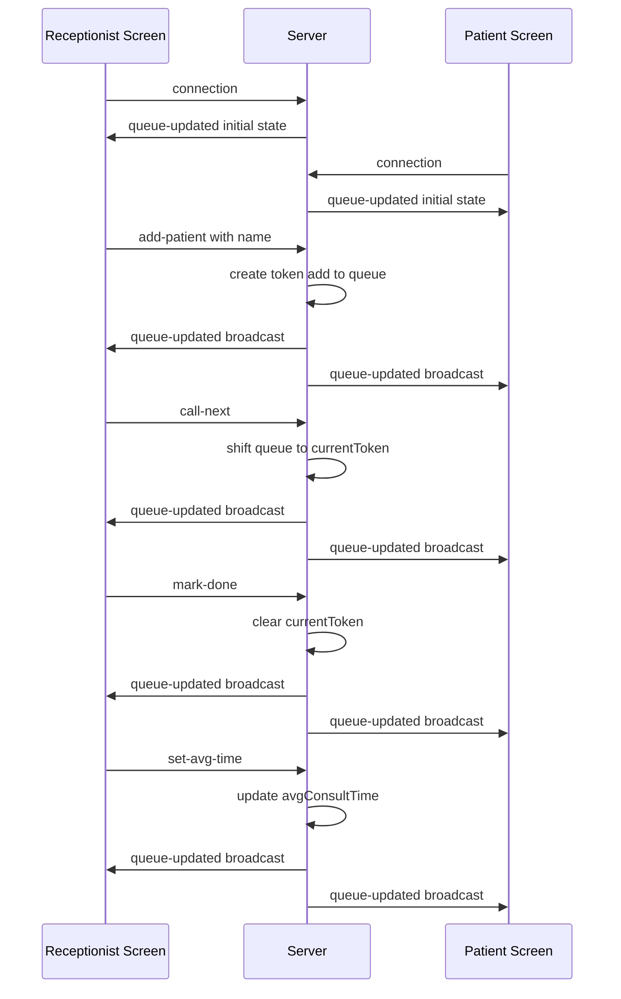

# Socket Event Diagram — Queue Cure '26

## Event Flow

## Event Reference

| Event Name | Direction | Payload | Triggered By | Effect |
|---|---|---|---|---|
| `connection` | Client → Server | — | Any screen loading | Server sends current state immediately |
| `queue-updated` | Server → All Clients | `{ queue, currentToken, avgConsultTime }` | Any state change | Both screens re-render with fresh data |
| `add-patient` | Client → Server | `{ name }` | Receptionist clicks "Add Patient" | New token created, pushed to queue |
| `call-next` | Client → Server | — | Receptionist clicks "Call Next" | First patient in queue becomes currentToken |
| `mark-done` | Client → Server | — | Receptionist clicks "Mark Done" | currentToken cleared |
| `set-avg-time` | Client → Server | `minutes` (number) | Receptionist edits time input | avgConsultTime updated, wait times recalculate |
| `error-message` | Server → Client | `string` | Invalid action (empty name, empty queue) | Client shows alert |
| `disconnect` | Client → Server | — | Tab closed / refresh | Server logs disconnection |

## Why Broadcast (`io.emit`) Instead of Targeted (`socket.emit`)?

Every state-changing event uses `io.emit()` so **all connected clients** — the receptionist's own screen and every open patient screen — receive the update simultaneously. This is what makes the "live sync without refresh" requirement work: there's a single source of truth (the server's in-memory queue), and every screen is just a live mirror of it.